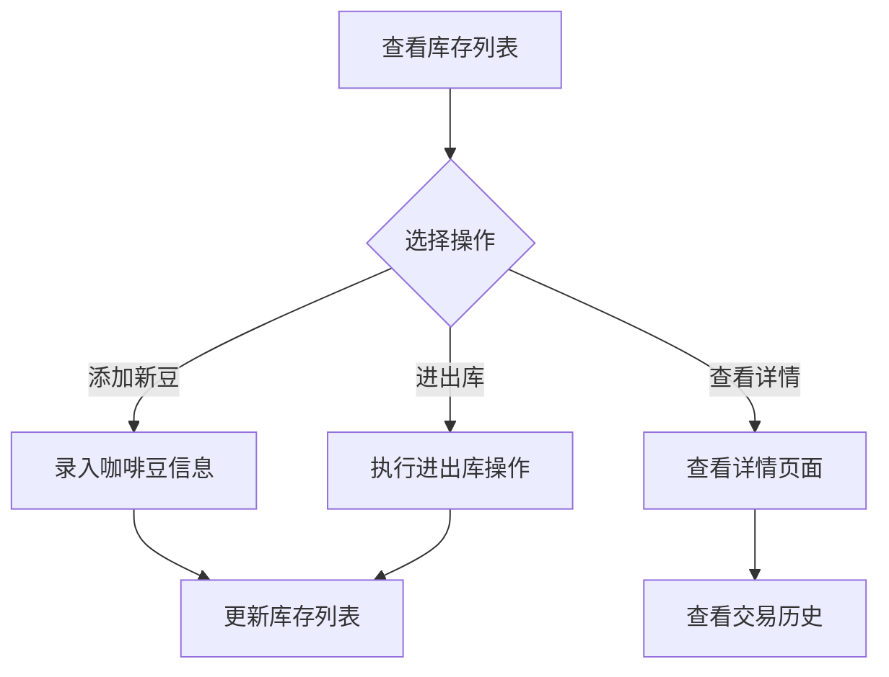
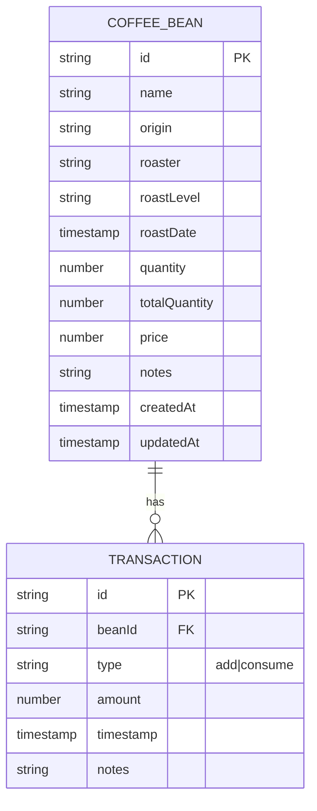

# 咖啡豆库存管理系统 - 产品需求文档

## 1. 产品概述

一款面向咖啡爱好者的咖啡豆库存管理应用，帮助用户追踪咖啡豆的采购、消耗和新鲜度。

- **核心目标**：管理咖啡豆库存，掌握消耗进度，确保最佳饮用时机
- **目标用户**：咖啡爱好者、自烘焙者、小型咖啡馆
- **核心价值**：可视化库存状态、智能提醒新鲜度、多设备同步

## 2. 核心功能

### 2.1 功能模块

1. **库存列表**
   - 显示所有咖啡豆当前库存状态
   - 按名称/烘焙日期/剩余量排序
   - 快速筛选低库存豆子

2. **咖啡豆详情**
   - 展示完整信息：名称、产地、烘焙商、烘焙日期、风味描述
   - 库存进度条可视化
   - 交易历史记录

3. **新增/编辑咖啡豆**
   - 录入完整咖啡豆信息
   - 自动计算新鲜度状态

4. **进出库操作**
   - 入库：记录新购入的咖啡豆
   - 出库：记录冲煮消耗的咖啡豆
   - 操作日志追溯

5. **保质期监控**
   - 显示烘焙天数
   - 颜色标识新鲜度状态（新鲜/良好/接近过期/过期）

## 3. 核心流程



## 4. 用户界面设计

### 4.1 设计风格
- **色调**：深棕色调（咖啡色系）+ 奶油白背景，温暖自然的咖啡馆氛围
- **主色调**：`#5D4037`（深咖啡棕）
- **次要色**：`#D7CCC8`（奶油米色）
- **强调色**：`#FF7043`（活力橙）
- **字体**：标题用 Playfair Display（优雅衬线），正文用 Source Sans 3（清晰无衬线）
- **布局**：卡片式布局，库存以卡片网格展示

### 4.2 页面设计

| 页面 | 模块 | UI元素 |
|------|------|--------|
| 库存列表 | 头部导航 | Logo、添加按钮 |
| 库存列表 | 筛选栏 | 搜索框、排序选择器 |
| 库存列表 | 咖啡豆卡片 | 名称、烘焙日期、进度条、快速操作按钮 |
| 详情页 | 信息区 | 咖啡豆图片区、基本信息卡片 |
| 详情页 | 库存状态 | 进度条、烘焙天数、新鲜度标识 |
| 详情页 | 操作区 | 入库/出库按钮 |
| 详情页 | 历史记录 | 操作流水列表 |
| 表单页 | 输入区 | 表单字段：名称、产地、烘焙商等 |

### 4.3 响应式设计
- 桌面端：卡片网格多列布局
- 移动端：单列卡片列表，底部固定操作栏

## 5. 技术架构

### 5.1 技术栈
- **框架**：React 18 + TypeScript + Vite
- **UI**：Tailwind CSS + shadcn/ui
- **状态管理**：Zustand
- **路由**：React Router v6
- **后端/数据**：Firebase Firestore（本地优先 + 云端同步）

### 5.2 数据模型



### 5.3 目录结构
```
src/
├── features/
│   └── inventory/          # 库存模块
│       ├── components/     # 库存相关组件
│       ├── hooks/           # 库存相关hooks
│       ├── services/       # Firestore操作
│       └── types.ts        # 类型定义
├── shared/                 # 共享组件
├── firebase/               # Firebase配置
├── pages/                  # 页面
└── lib/                    # 工具函数
```

## 6. 未来扩展预留

- 冲泡记录模块
- 杯测评分模块
- 购物清单模块
- 用户认证系统