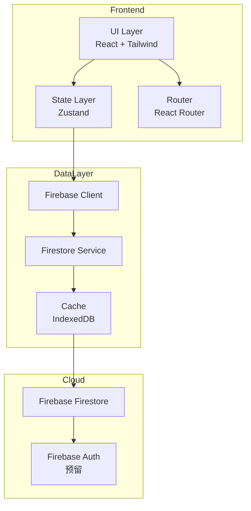

# 咖啡豆库存管理系统 - 技术架构文档

## 1. 架构设计



## 2. 技术选型

| 层级 | 技术 | 版本 | 说明 |
|------|------|------|------|
| 框架 | React | 18.x | 主流框架，生态完善 |
| 构建 | Vite | 5.x | 快速开发体验 |
| 语言 | TypeScript | 5.x | 类型安全 |
| 样式 | Tailwind CSS | 3.x | 原子化CSS |
| 组件 | shadcn/ui | latest | 基于Radix的组件库 |
| 状态 | Zustand | 4.x | 轻量状态管理 |
| 路由 | React Router | 6.x | SPA路由 |
| 数据 | Firebase Firestore | 10.x | 实时数据库 |
| 图标 | Lucide React | latest | 一致的图标风格 |

## 3. 路由定义

| 路由 | 页面 | 说明 |
|------|------|------|
| `/` | 库存列表页 | 首页，显示所有咖啡豆 |
| `/add` | 新增页面 | 添加新的咖啡豆 |
| `/bean/:id` | 详情页面 | 查看咖啡豆详情 |
| `/bean/:id/edit` | 编辑页面 | 编辑咖啡豆信息 |

## 4. API 定义（Firebase Service Layer）

### 4.1 CoffeeBean Service

```typescript
interface CoffeeBean {
  id: string;
  name: string;
  origin: string;
  roaster: string;
  roastLevel: 'light' | 'medium' | 'dark';
  roastDate: Timestamp;
  quantity: number;
  totalQuantity: number;
  price: number;
  notes: string;
  createdAt: Timestamp;
  updatedAt: Timestamp;
}

interface Transaction {
  id: string;
  beanId: string;
  type: 'add' | 'consume';
  amount: number;
  timestamp: Timestamp;
  notes: string;
}

// Service Methods
coffeeBeanService.getAll(): Promise<CoffeeBean[]>
coffeeBeanService.getById(id: string): Promise<CoffeeBean | null>
coffeeBeanService.create(data: Omit<CoffeeBean, 'id'>): Promise<CoffeeBean>
coffeeBeanService.update(id: string, data: Partial<CoffeeBean>): Promise<void>
coffeeBeanService.delete(id: string): Promise<void>

transactionService.getByBeanId(beanId: string): Promise<Transaction[]>
transactionService.create(data: Omit<Transaction, 'id'>): Promise<Transaction>
```

## 5. 数据模型

### 5.1 CoffeeBean 集合

```typescript
// Collection: coffeeBeans
{
  id: string;                    // Firestore auto-generated
  name: string;                  // 必填，咖啡豆名称
  origin: string;                // 产地，如"埃塞俄比亚"
  roaster: string;               // 烘焙商名称
  roastLevel: 'light' | 'medium' | 'dark';
  roastDate: Timestamp;          // 烘焙日期
  quantity: number;              // 当前库存（克）
  totalQuantity: number;         // 原始购入量（克）
  price: number;                 // 价格（元）
  notes: string;                 // 风味描述等备注
  createdAt: Timestamp;          // 创建时间
  updatedAt: Timestamp;          // 更新时间
}
```

### 5.2 Transaction 集合

```typescript
// Collection: transactions
{
  id: string;                    // Firestore auto-generated
  beanId: string;                // 关联的咖啡豆ID
  type: 'add' | 'consume';       // 操作类型
  amount: number;                // 数量（克）
  timestamp: Timestamp;         // 操作时间
  notes: string;                // 操作备注
}
```

## 6. Firebase 配置

### 6.1 本地优先策略
- 启用 Firestore 脱机持久化
- 所有读写操作优先本地，再同步云端
- 自动冲突解决（最后写入胜出）

### 6.2 安全规则（基础版暂不启用）
```javascript
rules_version = '2';
service cloud.firestore {
  match /databases/{database}/documents {
    match /coffeeBeans/{bean} {
      allow read, write: if true;  // 测试用，生产环境需添加auth检查
    }
    match /transactions/{trans} {
      allow read, write: if true;
    }
  }
}
```

## 7. 组件结构

```
src/
├── features/
│   └── inventory/
│       ├── components/
│       │   ├── BeanCard.tsx         # 库存卡片
│       │   ├── BeanForm.tsx         # 添加/编辑表单
│       │   ├── BeanDetail.tsx      # 详情主体
│       │   ├── QuantityBar.tsx      # 库存进度条
│       │   ├── FreshnessBadge.tsx   # 新鲜度标识
│       │   └── TransactionList.tsx  # 交易历史
│       ├── hooks/
│       │   ├── useCoffeeBeans.ts   # 咖啡豆数据hooks
│       │   └── useTransactions.ts   # 交易记录hooks
│       ├── services/
│       │   ├── coffeeBeanService.ts # 咖啡豆CRUD
│       │   └── transactionService.ts # 交易记录
│       └── types.ts                # 类型定义
├── pages/
│   ├── InventoryPage.tsx            # 库存列表页
│   ├── AddBeanPage.tsx             # 新增页
│   └── BeanDetailPage.tsx          # 详情页
├── components/
│   ├── ui/                         # shadcn/ui组件
│   └── Layout.tsx                  # 布局组件
├── firebase/
│   ├── config.ts                   # Firebase初始化
│   └── index.ts                    # 导出
└── lib/
    ├── utils.ts                    # 工具函数
    └── constants.ts                # 常量定义
```

## 8. 开发规范

- 组件文件不超过 200 行
- 使用 TypeScript 严格模式
- 所有颜色通过 Tailwind CSS 类名使用
- 使用 lucide-react 图标库
- 响应式优先移动端设计